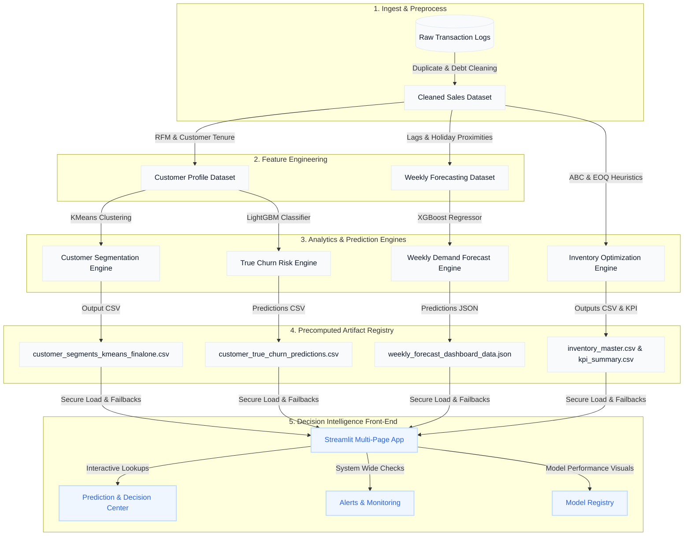

# RetailPulse: AI-Powered Retail Analytics & Decision Intelligence Platform

[](https://www.python.org/)
[](https://streamlit.io/)
[](#)

RetailPulse is an end-to-end predictive machine learning and decision intelligence platform built for B2B wholesale retail operators. By combining advanced classification, regression, and clustering algorithms with operations research optimization heuristics, the platform turns raw transaction ledgers into proactive strategies for customer retention, inventory management, demand readiness, and automated risk mitigation.

---

## Table of Contents
1. [Project Overview](#project-overview)
2. [Platform Architecture](#platform-architecture)
3. [Folder Structure](#folder-structure)
4. [Technology Stack](#technology-stack)
5. [Machine Learning & Heuristic Modules](#machine-learning--heuristic-modules)
   - [Customer Segmentation](#customer-segmentation)
   - [True Churn Prediction](#true-churn-prediction)
   - [Demand Forecasting](#demand-forecasting)
   - [Inventory Optimization](#inventory-optimization)
6. [Interactive Dashboard Modules](#interactive-dashboard-modules)
7. [Operational Workflow](#operational-workflow)
8. [Performance & Business Results](#performance--business-results)
9. [Installation & Setup](#installation--setup)
10. [Visual Assets & Screen Layouts](#visual-assets--screen-layouts)
11. [Future Roadmap](#future-roadmap)
12. [Repository Details](#repository-details)

---

## 1. Project Overview

### The Business Problem
Wholesale B2B retail operations suffer from fragmented decision-making:
* **Customer Churn:** Managers struggle to identify when commercial accounts are drifting away before they completely stop ordering.
* **Stockouts vs. Holding Costs:** Over-purchasing ties up working capital, while stockouts of high-velocity items cause massive revenue drops.
* **Unpredictable Demand:** Extreme seasonal fluctuations (like Q4 holiday spikes) lead to capacity bottlenecks or stock gluts.
* **Generic Marketing:** Treating small weekend buyers and massive weekday enterprise clients the same way dilutes marketing ROI.

### Platform Solution
RetailPulse solves these operational pain points by integrating predictive ML models and inventory heuristics into a single, cohesive, secure decision-support dashboard. Instead of generating abstract scores, it prescribes concrete actions—such as specific purchase orders (EOQs) and personalized retention sequences—tailored to each product class and customer risk cohort.

---

## 2. Platform Architecture

The diagram below maps the unidirectional data pipeline from raw transactional ingestion to the client-facing Streamlit interface:



---

## 3. Folder Structure

The repository follows a clean, modular structure separating machine learning pipelines, precomputed datasets, static analysis reports, and dashboard pages:

```text
RetailPulse/
├── churn_prediction_true/     # True Churn Prediction Pipeline
│   ├── models/                # Serialized model binaries (.pkl)
│   ├── predictions/           # Generated batch inference outputs (.csv)
│   ├── reports/               # Churn-specific evaluation markdown reports
│   └── scripts/               # Data prep, training, and report generation scripts
├── customer_segmentation/     # Customer Segmentation Module
│   ├── datasets/              # Segment assignment files (.csv)
│   ├── documentation/         # Feature definitions & pipeline steps
│   ├── reports/               # KMeans profiling & DBSCAN validation reports
│   └── scripts/               # Clustering, cleaning, and evaluation scripts
├── dashboard/                 # Streamlit Web Application
│   ├── app.py                 # Multi-page landing entrypoint
│   ├── auth/                  # Authentication & session state management
│   ├── components/            # Sidebar navigation & common UI wrappers
│   └── pages/                 # Streamlit UI modules (Pages 1 to 10)
├── Demand_Forecasting/        # Weekly Demand Forecasting Module
│   ├── datasets/              # Weekly forecast datasets (.json, .csv)
│   ├── reports/               # Hyperparameter tuning and MAPE reports
│   └── scripts/               # Optuna tuning, lag engineering, training scripts
├── eda_output/                # EDA visualization output files
├── inventory_optimization/    # Inventory Optimization Engine
│   ├── outputs/               # Master reorder matrices (.csv)
│   └── reports/               # ABC & EOQ heuristic summaries (.md, .json)
├── processed_data/            # System-wide cleaned datasets & audit summaries
├── requirements.txt           # Dependency management mapping
└── README.md                  # Primary repository documentation
```

---

## 4. Technology Stack

* **Core Engine:** Python (v3.11)
* **Data Wrangling:** Pandas (v3.0.1), NumPy (v2.4.6)
* **Machine Learning Frameworks:** Scikit-Learn (v1.8.0), LightGBM (v4.6.0), XGBoost (v3.2.0)
* **Hyperparameter Tuning:** Optuna (v4.9.0)
* **Visualization Suite:** Plotly (v6.8.0), Matplotlib (v3.10.8), Seaborn (v0.13.2)
* **Serialization:** Joblib (v1.5.3)
* **Data Serializers:** JSON, CSV
* **Presentation Layer:** Streamlit (v1.56.0)

---

## 5. Machine Learning & Heuristic Modules

### Customer Segmentation
* **Algorithm:** KMeans Clustering (Optimal $K=3$ selected via Silhouette and Elbow validation; refund/cancellation outliers representing 103 records or 2.35% of the base were systematically cleaned).
* **Feature Matrix:** Recency, Frequency, Monetary (RFM), Customer Tenure, Average Order Value (AOV), and Weekend Sales Ratio.
* **Target Cohorts Identified:**
  * **VIP Loyal Champions:** 1,537 accounts (35.9% of base). Drive 85% of total company revenue ($7.04M spend). Average recency of 35.7 days.
  * **Lapsing Occasional Buyers:** 2,116 accounts (49.5% of base). High-risk inactive group averaging 123.8 days since their last order.
  * **Weekend Value Shoppers:** 623 accounts (14.6% of base). A distinct niche segment that conducts 76% of transactions over weekends.
* **Business Application:** Recommends concierge services for the top-tier VIP champions, reactivation win-back email cycles (at 90/120/150 day boundaries) for lapsing buyers, and Thursday evening promotions for weekend shoppers.

### True Churn Prediction
* **Algorithm:** LightGBM Binary Classifier fitted with class weights to compensate for target imbalance.
* **Target Construct:** Predicts whether a customer will record zero orders over a forward-looking 90-day window based strictly on chronological snapshots up to a cutoff point (`2010-09-10`).
* **Evaluation Performance (Holdout Set):**
  * **ROC AUC:** `71.77%`
  * **Recall (Sensitivity):** `62.31%`
  * **Accuracy:** `65.55%`
  * **Precision:** `61.07%`
  * **F1-Score:** `61.68%`
* **Core Risk Levers:** Identified through SHAP value attribution. *Recency* and *Average Days Between Purchases* are the highest risk indicators, while *Quantity Per Order*, *AOV*, and *Customer Tenure* act as strong retention buffers.
* **Business Application:** Identifies and ranks customers with >70% churn probability, triggering high-priority outreach before attrition occurs.

### Demand Forecasting
* **Algorithm:** Tuned XGBoost Regressor incorporating Calendrical Holiday Features.
* **Granularity:** Weekly aggregated sales (chosen over daily models to isolate high-frequency logistics noise).
* **Validation Performance (Chronological Split):**
  * **Validation MAPE:** `11.81%` (Successfully achieved target mandate of $\le 12\%$).
  * **Test MAPE:** `16.97%` (Test MAPE rises to `17.60%` when excluding the final partial week).
* **Tuning Protocol:** 100 trials of Optuna parameter optimization. Top parameters: `n_estimators=451`, `learning_rate=0.052`, `max_depth=5`, `subsample=0.888`.
* **Key Engineered Features:** `holiday_proximity_score` (representing 25.24% of feature importance), `weeks_until_christmas` (14.06%), `weeks_since_christmas` (10.14%), and rolling sales lags.

### Inventory Optimization
* **Methodology:** Operations Research heuristics utilizing demand statistics calculated over the verified calendar window of **699 days** (`2009-01-12` to `2010-12-11`).
* **ABC Classification (Revenue Pareto Principle):**
  * **Class A:** 889 products (20.9% of catalog). Generates ~80% of revenue. Set to 99% Service Level (Z=2.33, Lead Time=7 days).
  * **Class B:** 1,025 products (24.0% of catalog). Generates ~15% of revenue. Set to 95% Service Level (Z=1.65, Lead Time=10 days).
  * **Class C:** 2,348 products (55.1% of catalog). Generates ~5% of revenue. Set to 90% Service Level (Z=1.28, Lead Time=14 days).
* **Safety Stock & ROP Formulas:**
  $$SS = Z \times \sigma_{\text{daily demand}} \times \sqrt{LT}$$
  $$ROP = (d_{\text{daily demand}} \times LT) + SS$$
  $$EOQ = \sqrt{\frac{2 \times \text{Annual Demand} \times \text{Order Cost (\$50.00)}}{\text{Holding Cost (20\% of Unit price)}}}$$
* **Current Operations Metrics:** Evaluated catalog health yields an **Inventory Health Score of 52.44/100** (🔴 Critical Attention Required) due to simulated stock falling below safety limits on 36% of the catalog.

---

## 6. Interactive Dashboard Modules

The user interface is split into 10 key modules, protected behind session-based authentication (Credentials: Username: `admin`, Password: `retailpulse123`):

| Page File | Dashboard Module | Core Visualizations & Interactive Components |
| :--- | :--- | :--- |
| `app.py` | **Authentication Gateway** | Secure login portal handling session parameters and routing validations. |
| `1_Executive_Overview.py` | **Executive Overview** | High-level platform index summarizing operational capabilities. |
| `2_Demand_Forecasting.py` | **Demand Forecasting** | Out-of-sample weekly demand projections (8-week horizon) with validation MAPE metrics. |
| `3_Customer_Segmentation.py` | **Customer Segmentation** | Customer segment shares (donut chart), RFM matrices, and strategic playbook tabs. |
| `4_Churn_Prediction.py` | **Churn Prediction** | Customer risk distribution charts, SHAP importance bars, and high-probability attrition list. |
| `5_Inventory_Optimization.py` | **Inventory Optimization** | ABC revenue pie charts, stock risk bar charts, and immediate purchase recommendations. |
| `6_Alerts_and_Monitoring.py` | **Alerts & Monitoring** | Live warning hub highlighting inventory deficits, revenue at risk, and demand surges/drops. |
| `7_Export_Center.py` | **Export Center** | Tabular export suite for raw/processed prediction CSVs and Excel reports. |
| `8_Admin_Panel.py` | **Admin Panel** | Configuration controls for thresholds, lead times, and service levels. |
| `9_Prediction_and_Decision_Center.py` | **Prediction & Decision Center** | Joint lookup querying individual Customer IDs and Product IDs to prescribe actions. |
| `10_Model_Registry.py` | **Model Registry** | Status center checking if ML model assets exist and displaying training specifications. |

---

## 7. Operational Workflow

```text
               [STAGE 1: CLEANING]
               - Ingest transaction records (Initial: 525,461 rows)
               - Remove duplicates (6,865 rows) and bad debt/test records
               - Final cleaned baseline: 514,834 rows
                        │
                        ▼
               [STAGE 2: FEATURE ENGINEERING]
               - Aggregate transactions to weekly timelines for demand lag structures
               - Calculate recency, frequency, monetary, and tenure values per customer
                        │
                        ▼
               [STAGE 3: MODEL TRAINING & TUNING]
               - Run KMeans on customer features to segment the buyer base
               - Train LightGBM classifier with class weights to predict 90-day churn
               - Train Optuna-optimized XGBoost regressor for demand forecasting
                        │
                        ▼
               [STAGE 4: HEURISTIC FORMULATION]
               - Perform revenue sorting to categorize catalog items (Class A/B/C)
               - Calculate EOQ, Safety Stock, and ROP buffers over a 699-day window
                        │
                        ▼
               [STAGE 5: DECISION PRESENTATION]
               - Serve outputs through Streamlit pages (using precomputed CSV/JSON datasets)
               - Automatically surface critical warnings via the Alerts and Monitoring system
```

---

## 8. Performance & Business Results

* **Data Integrity Cleared:** Data cleaning process reduced input logs from 525,461 to 514,834 rows, removing zero-pricing and bank test charges while retaining returns to represent customer attrition features cleanly.
* **Accuracy Target Met:** Achieved a **11.81% validation MAPE** for weekly demand forecasting (satisfying target mandate of $\le 12\%$).
* **Effective Attrition Segmentation:** Customer Churn model successfully isolated a high-risk cohort (27.72% of the population) representing an actual future churn rate of **91.58%**, compared to the low-risk segment churn rate of just **3.72%**.
* **Financial Protection:** Customer Segmentation exposed that **35.9% of customers (VIP segment) drive 85% of company spend ($7.04M)**, allowing management to immediately implement targeted VIP loyalty programs to protect high-density revenue.
* **Replenishment Recommendations:** The inventory engine identified that **36.0% of catalog products (1,536 items) are in critical risk**, generating automated Economic Order Quantity (EOQ) recommendations to resolve imminent stockouts.

---

## 9. Installation & Setup

### Prerequisites
* Python 3.11
* Virtualenv (Recommended)

### Step-by-Step Installation
1. **Clone the repository:**
   ```bash
   git clone https://github.com/Bhavesh1411/RetailPulse-AI-powered-Customer-Analytics-Demand-Forecasting-Platform.git
   cd RetailPulse-AI-powered-Customer-Analytics-Demand-Forecasting-Platform
   ```

2. **Create and activate a virtual environment:**
   ```bash
   python -m venv venv
   # On Windows:
   venv\Scripts\activate
   # On macOS/Linux:
   source venv/bin/activate
   ```

3. **Install platform requirements:**
   ```bash
   pip install -r requirements.txt
   ```

4. **Launch the interactive Streamlit dashboard:**
   ```bash
   cd dashboard
   streamlit run app.py
   ```

5. **Platform Authentication:**
   * Enter the temporary administrative credentials on the login screen:
     * **Username:** `admin`
     * **Password:** `retailpulse123`

---

## 10. Visual Assets & Screen Layouts

> [!NOTE]
> *This section holds placeholder markers for repository screenshots to be loaded once the application server is deployed on a public host.*

### Executive Overview Dashboard
```text
[ SCREENSHOT PLACEHOLDER: Executive Overview page showing high-level navigation cards ]
```

### Weekly Demand Forecasting
```text
[ SCREENSHOT PLACEHOLDER: Historical vs Forecasted weekly sales trend line chart ]
```

### Customer Segmentation Analytics
```text
[ SCREENSHOT PLACEHOLDER: Interactive customer segment donut chart and profiling tables ]
```

### True Churn Prediction & Drivers
```text
[ SCREENSHOT PLACEHOLDER: LightGBM SHAP feature importances and high-risk accounts table ]
```

### Inventory Optimization & ABC Cataloging
```text
[ SCREENSHOT PLACEHOLDER: ABC catalog distribution plots and immediate reorder matrix ]
```

### Prediction & Decision Center
```text
[ SCREENSHOT PLACEHOLDER: Individual Customer ID & Product ID prescribed action lookup interface ]
```

### Model Registry & Artifact Checks
```text
[ SCREENSHOT PLACEHOLDER: Unified Model Registry page detailing green/red artifact health badges ]
```

---

## 11. Future Roadmap

* **PostgreSQL Ingest Engine:** Transition from local CSV/JSON cache files to relational databases to support live, multi-user queries.
* **Docker Containerization:** Build Docker images for production deployment via container orchestration engines.
* **Cloud Infrastructure Hosting:** Host dashboard deployments using managed cloud platforms (AWS Elastic Beanstalk or GCP App Engine).
* **Automated MLOps Pipeline:** Integrate model retraining triggers using Apache Airflow or GitHub Actions as soon as new transaction logs are added to the database.

---

## 12. Repository Details

* **Current Build Status:** Business Validation Complete (Pilot Ready)
* **Lead Author:** Bhavesh1411
* **License:** *Proprietary / Under Internal Validation*
* **Disclaimer:** Inventory stock balances are generated as simulations using a reproducible seed (seed=42) to support decision-making, as historical stock values were absent from the transaction logs. All outputs should be used as decision-support simulations.