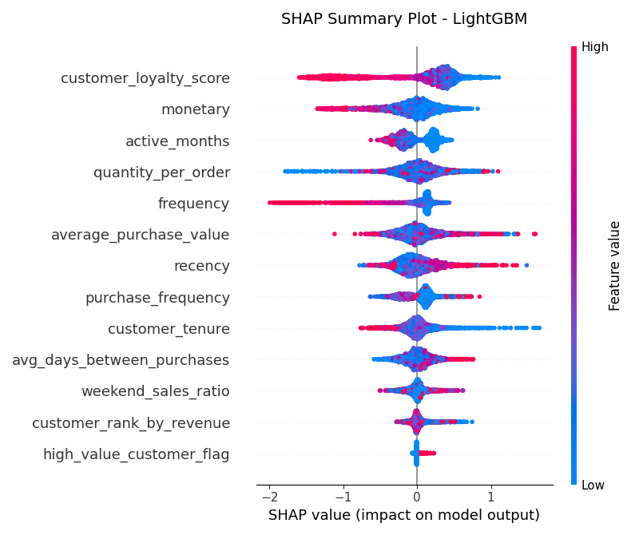

# Feature Importance and Model Interpretation Report

This report provides a detailed breakdown of the features driving the predictions of the champion **LightGBM** model.

## Executive Summary

1. **Top Churn Drivers (Risk Factors):**
   - **recency** (Importance: 426.0000, Correlation: 0.2245)
   - **avg_days_between_purchases** (Importance: 251.0000, Correlation: 0.1919)
   - **customer_rank_by_revenue** (Importance: 162.0000, Correlation: 0.3251)

2. **Top Retention Drivers (Loyalty Factors):**
   - **quantity_per_order** (Importance: 513.0000, Correlation: -0.0074)
   - **average_purchase_value** (Importance: 483.0000, Correlation: -0.0540)
   - **customer_tenure** (Importance: 324.0000, Correlation: -0.1880)
   - **monetary** (Importance: 294.0000, Correlation: -0.1227)
   - **weekend_sales_ratio** (Importance: 162.0000, Correlation: -0.0161)

---

## 1. Feature Importance Rankings

Below is the complete feature importance ranking based on the `MDI Feature Importance` from the `LightGBM` model.

| Rank | Feature Name | Importance Score | Relationship to Churn | Business Interpretation |
| :---: | :--- | :---: | :--- | :--- |
| 1 | `quantity_per_order` | 513.000000 | Negative (Decreases Risk) | Average items purchased per order. Stable wholesale orders indicate steady supply chain demands. |
| 2 | `average_purchase_value` | 483.000000 | Negative (Decreases Risk) | Average size of invoice in cash. Larger orders correlate with stable commercial accounts. |
| 3 | `recency` | 426.000000 | Positive (Increases Risk) | Days since last purchase. Higher recency is a classic and direct sign of inactivity. |
| 4 | `customer_tenure` | 324.000000 | Negative (Decreases Risk) | Days since first purchase. Customers with long tenure have established relationships, making them less volatile. |
| 5 | `monetary` | 294.000000 | Negative (Decreases Risk) | Total spending. High value customers are less likely to churn unless neglected. |
| 6 | `avg_days_between_purchases` | 251.000000 | Positive (Increases Risk) | Average gap between orders. A larger gap means a slower purchase cycle and higher churn risk. |
| 7 | `customer_rank_by_revenue` | 162.000000 | Positive (Increases Risk) | Revenue ranking (lower is higher spend). Higher rank (larger rank number) means lower spending, correlating with churn. |
| 8 | `weekend_sales_ratio` | 162.000000 | Negative (Decreases Risk) | Proportion of sales on weekends. B2B businesses typically buy during weekdays; weekend retail buyers have slightly different churn habits. |
| 9 | `customer_loyalty_score` | 161.000000 | Negative (Decreases Risk) | Composite RFM loyalty rating. High loyalty strongly shields against churn. |
| 10 | `purchase_frequency` | 115.000000 | Negative (Decreases Risk) | Orders per active month. High velocity buyers represent active business clients. |
| 11 | `frequency` | 65.000000 | Negative (Decreases Risk) | Total transactions. High frequency indicates strong habit and loyalty, reducing churn risk. |
| 12 | `active_months` | 39.000000 | Negative (Decreases Risk) | Number of months active. Consistent monthly buyers show high retention. |
| 13 | `high_value_customer_flag` | 5.000000 | Negative (Decreases Risk) | Top 10% revenue flag. Indicates high-value enterprise accounts. |

---

## 2. SHAP (SHapley Additive exPlanations) Analysis

SHAP values offer a game-theoretic approach to explaining the output of the machine learning model. Unlike global feature importance, SHAP shows:
1. Whether a high or low value of a feature pushes the churn probability up or down.
2. The exact distribution of impact across all customers in the test set.

### SHAP Plot Interpretation

- **Feature Value Color:** Blue represents low values of the feature, and Red represents high values.
- **SHAP Value (X-Axis):** A positive SHAP value (right of center) indicates that the feature value pushes the prediction towards **Churn (1)**. A negative SHAP value (left of center) pushes the prediction towards **Active (0)**.
- **Example - Recency:** High recency (Red dots) is spread far to the right, showing a massive positive impact on churn probability. Low recency (Blue dots) is clustered to the left, showing a strong retention pull.
- **Example - Customer Loyalty Score:** High loyalty score (Red dots) is pulled to the left, acting as a strong negative force (retaining the customer).
